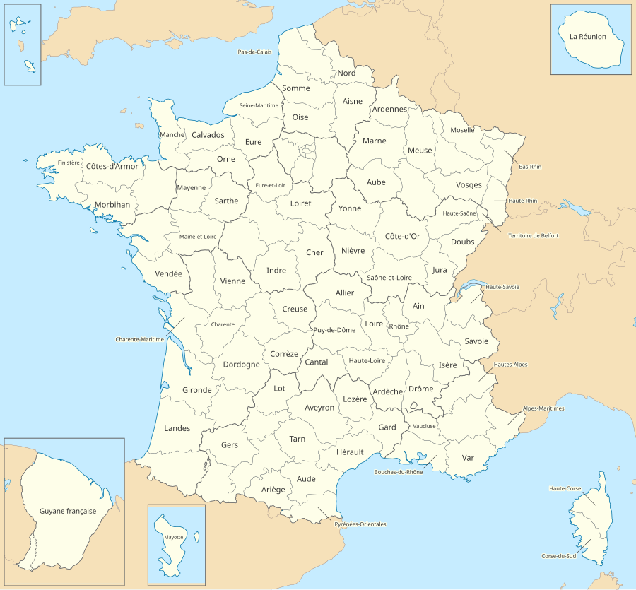
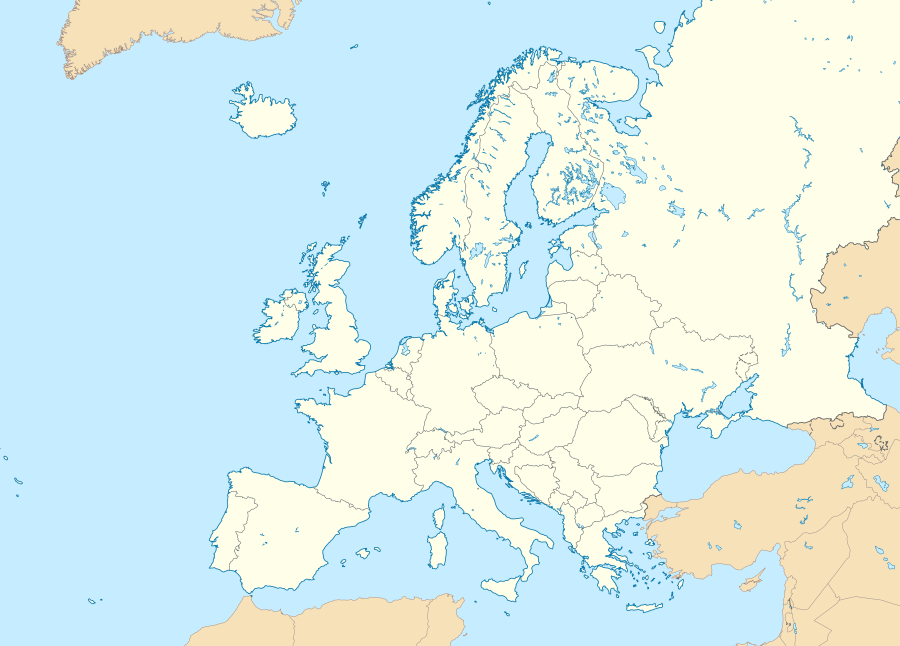
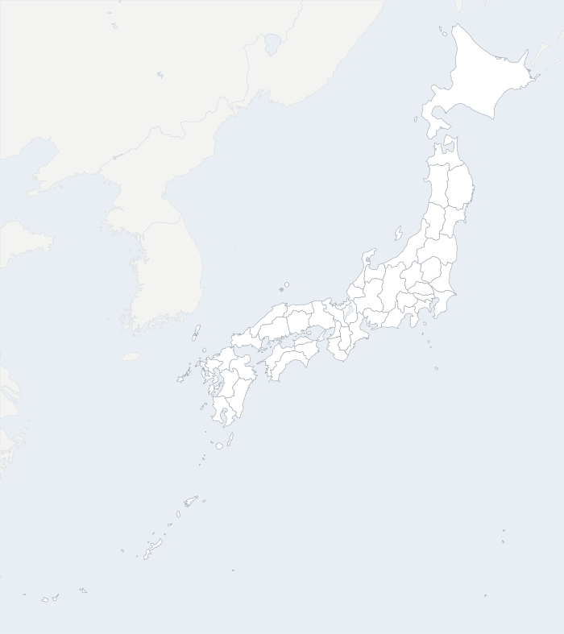
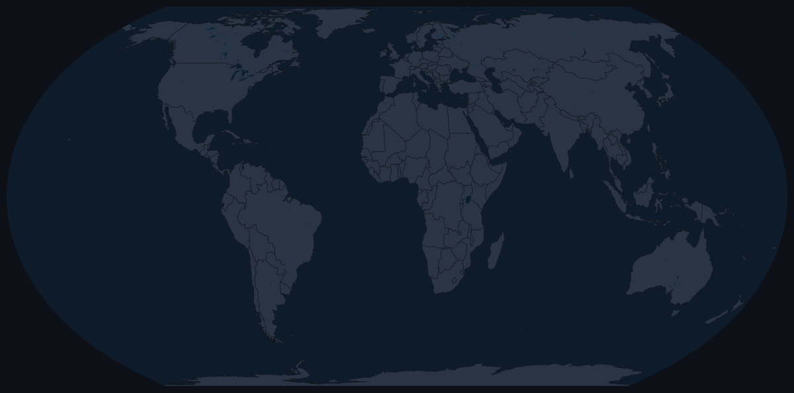
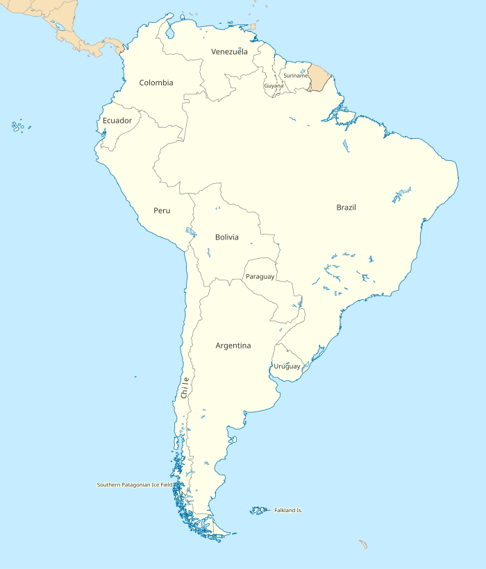
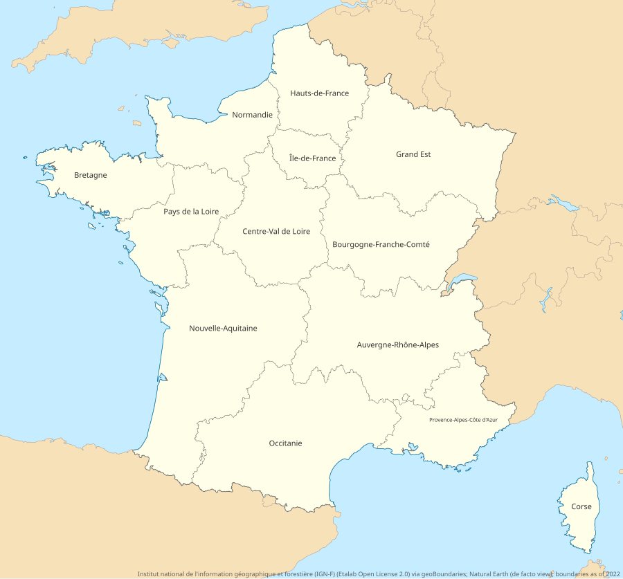
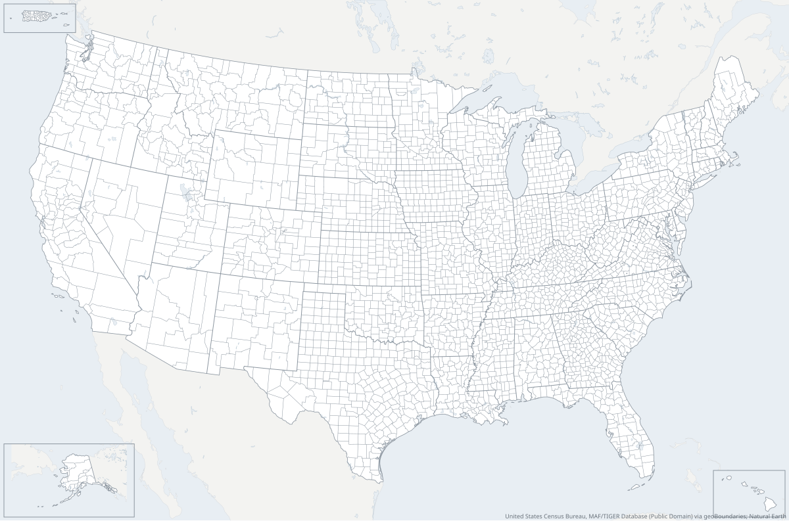
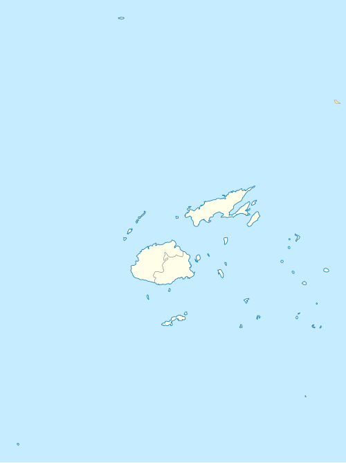

# map-generator

A deterministic pipeline that turns authoritative GIS boundary data into clean,
lightweight, restylable SVG maps of the world, continents, countries, and their
subdivisions. The default style follows Wikimedia Commons location maps.

**Open data only.** Every supported source is public domain or openly licensed,
and each map records its data credit.



```sh
scripts/fetch-data.sh ne-geojson    # Natural Earth, public domain, ~56 MB
cargo build --release
./target/release/mapgen render -i data/ne_10m_admin_1.geojson --dataset ne-admin1 --region FRA \
    --context data/ne_10m_admin_0.geojson --lakes data/ne_10m_lakes.geojson --labels \
    -o france.svg
```

Each region is its own selectable element, carrying its code, its parent and its country:

```xml
<path id="FR-75" class="mg-land subdivision fr" data-name="Paris" data-code="FR-75"
      data-parent="FR-IDF" d="M…Z"><title>Paris, Île-de-France</title></path>
```

`data-code` is the region's code as given by the data (the `id` is made XML-safe and unique),
`data-parent` the enclosing unit's code, and the lowercase ISO 3166-1 alpha-2 class
(`fr`, `us`…) lets colouring tools such as [Maphue](https://github.com/schiste/map-coloring)
colour the map by country, neighbours included.

## Features

- **Deterministic.** The same input and options give byte-identical output on every OS and in WebAssembly, so maps can be committed, diffed and cached.
- **The right projection.** Lambert azimuthal equal-area for most regions, Albers equal-area conic for wide mid-latitude countries (the US, Canada, Russia, China), Equal Earth for world maps; `albers`, `lcc` or any `epsg:<code>` on request (EPSG needs the `proj` build feature).
- **Borders drawn once, by kind.** Shared borders are simplified and drawn once (TopoJSON-style arcs), so neighbours never show gaps or doubled lines. Borders between groups of regions (e.g. régions on a département map, states on a county map) are thicker; the outline of the mapped area, neighbouring countries' borders and disputed boundaries (dashed) each have their own style.
- **Antimeridian-safe.** Fiji, Russia and Kiribati are centred correctly, and datasets' artificial 180° cuts (Taveuni) are never drawn as borders.
- **Insets.** Far-away parts (Alaska, Hawaii, Puerto Rico, French overseas départements) go in corner boxes, sized by area and placed where they cover the least of the map.
- **Labels that fit.** Placed at each region's visual centre, shrunk to fit, curved along long thin shapes (Chile), or outside small regions with a leader line where that covers no other region.
- **Two datasets, one border.** Neighbouring countries from one dataset are snapped onto the outline of regions from another, closing gaps and doubled borders.
- **Easy restyling.** Four themes plus a flag for every colour. Colours live in one `<style>` block, can be emitted as CSS custom properties, and `.html` output adds live colour pickers.
- **Data tools.** `mapgen convert` writes indexed GeoPackages (3–4× faster renders) and borrows readable ids (ISO 3166-2, FIPS) by spatial overlap; `mapgen check` finds invalid polygons, slivers, overlaps and near-miss borders, and `--repair` fixes what it safely can. `mapgen match` reports data codes a map lacks (usually data and boundaries from different years), and `mapgen reshape` moves data to new codes through a crosswalk: renames and merges automatically, splits by weight, and anything ambiguous listed for a decision.

## Gallery

| | |
| --- | --- |
|  |  |
|  |  |
|  |  |
|  | |

Open [`docs/examples/france-departements.html`](docs/examples/france-departements.html)
locally for the interactive colour editor. Regenerate everything with `scripts/build-examples.sh`.

## Colours

Every map has five visual layers, each with its own colour:

| Slot | Flag | What it paints |
| --- | --- | --- |
| background | `--background` | Canvas: padding, around a world map's outline, or behind `--water none` |
| water | `--water` | Sea (map frame or globe) and lakes |
| land | `--land` / `--earth` | The regions being mapped |
| context-land | `--context-land` | Neighbouring countries |
| border | `--border` | Borders between mapped regions (width: `--border-width`, `--parent-border-width`) |
| outline | `--outline` | Outer edge of the mapped area: borders with neighbours (`--outline-width`) |
| coast | `--coast` | Outer edge along the sea (told apart from land borders when `--context` is given) |
| context-border, lake-border, disputed-border, label | `--context-border` … | Other strokes and text |

```sh
mapgen render … --theme dark                                   # wikimedia | light | dark | mono
mapgen render … --water '#bfe3f2' --earth '#fff8e7' --background none
mapgen render … -o map.html                                    # interactive colour pickers + "Download SVG"
mapgen render … --css-vars -o map.svg                          # restyle from page CSS (below)
mapgen themes                                                  # list themes and frame presets
```

With `--css-vars`, an SVG inlined in a web page can be recoloured from CSS:

```css
.my-map { --mg-water: #0b3d91; --mg-land: #f5f5f5; --mg-context-land: #ddd; }
.my-map .mg-land:hover { fill: gold; }
#FR-75 { fill: crimson; }
```

## CLI

```sh
# Départements with régions as parents, neighbours, lakes, disputed borders, labels;
# overseas départements go in insets automatically
mapgen render -i data/ne_10m_admin_1.geojson --dataset ne-admin1 --region FRA --labels \
    --context data/ne_10m_admin_0.geojson --lakes data/ne_10m_lakes.geojson \
    --disputed data/ne_10m_disputed_lines.geojson -o france.svg

# Finer subdivisions from geoBoundaries (ADM1–ADM5), converted once into an
# indexed GeoPackage with readable ids borrowed from a reference layer
scripts/fetch-data.sh geoboundaries USA ADM2 && scripts/fetch-data.sh us-counties-fips
mapgen convert -i data/geoboundaries/USA-ADM2.geojson --dataset geoboundaries -o usa-counties.gpkg \
    --ids-from data/us-counties-fips.geojson --ids-column id --ids-parent-column STATE --ids-prefix US-
mapgen render -i usa-counties.gpkg --dataset geoboundaries --credit -o usa.svg   # US-06037, …
# …plus state names in tooltips ("Lancaster, Nebraska"): add to convert
#   --parent-names data/us-states.txt --parent-names-key STATE --parent-names-column STATE_NAME
# Sources without codes: assign them from a table (CSV, TSV or pipe-separated)
#   --codes-from codes.csv --codes-key name --codes-column fips [--codes-parent-column state]

# Projections
mapgen render … --projection albers --parallels 29.5,45.5
mapgen render … --projection epsg:5070          # needs: cargo build --release --features proj

# A continent, a custom box, or the world
mapgen render -i data/ne_10m_admin_0.geojson --dataset ne-admin0 --continent Europe -o europe.svg
mapgen render -i data/ne_10m_admin_0.geojson --dataset ne-admin0 --bbox=-20,25,60,72 -o box.svg
mapgen render -i data/ne_10m_admin_0.geojson --dataset ne-admin0 --frame world --center-lon 150 -o pacific.svg

# Data reported for units that aren't the map's regions (New York City = 5 counties,
# health districts…): a table map_id,data_unit_id[,data_unit_name] tags each region with
# data-unit, or --dissolve merges each unit into one shape. Warns about units that don't
# nest (a region in two units), units split into parts, and ids not on the map.
mapgen render … --units units.csv --dissolve

# Disputed borders: Natural Earth's point of view for a country, disputed areas hatched
scripts/fetch-data.sh ne-worldview IND
mapgen render … --context data/ne_10m_admin_0.geojson --worldview IND \
    --disputed-areas data/ne_10m_disputed_areas.geojson     # credit: "Natural Earth (IND view)"

# Data from another boundary year: find the mismatches, then move the data to the
# map's codes. Codes missing from the crosswalk are kept as they are (--complete to
# refuse); splits without weights are written to out.conflicts.csv and stop the run.
mapgen match --data data.csv --code-column fips --code-prefix US- --map counties.svg --max-missing 0.01
mapgen crosswalk --from counties-2010.geojson --to counties-2020.geojson -o cw.csv   # area weights
mapgen reshape --data data.csv --code-column fips --crosswalk cw.csv --weight-column weight -o out.csv

# Check and repair input data
mapgen check -i data/geoboundaries/AUT-ADM2.geojson --dataset geoboundaries
mapgen convert -i data/geoboundaries/AUT-ADM2.geojson --dataset geoboundaries --repair -o aut.gpkg

# Every country's Admin-1 map, in parallel (--check reports input issues per map)
mapgen batch -i data/ne_10m_admin_1.geojson --dataset ne-admin1 --context data/ne_10m_admin_0.geojson --out-dir out/

# Many geoBoundaries files at once: a directory, a glob, or a list (one map per file,
# each credited from its own licence); --regions skips other countries' files unread
scripts/fetch-data.sh geoboundaries ALL ADM1 --simplified
mapgen batch -i data/geoboundaries --dataset geoboundaries --context data/ne_10m_admin_0.geojson --credit --out-dir out/
```

Other useful flags: `--width`, `--padding`, `--simplify` (px), `--min-area` (px²), `--margin`,
`--frame auto|all|world`, `--insets auto|none`, `--max-insets`, `--snap` (px), `--no-leaders`,
`--no-curved-labels`, `--label-min-scale`, `--parent-column`, `--name-column name_fr` (Natural Earth
ships names in about 40 languages), and `--attribution` / `--credit`. Run `mapgen render --help` for the full list.

## In the browser (WebAssembly)

The same engine runs in the browser and Node.js through
[`crates/mapgen-wasm`](crates/mapgen-wasm), with byte-identical output to the CLI
(CI re-renders the gallery in WebAssembly and compares it with the native files).

```js
const gen = new MapGenerator();
gen.setSubject(admin1GeoJson, { dataset: "ne-admin1" });   // parsed once
const { svg } = gen.render({ region: "FRA", theme: "dark", colors: { water: "#123" } });
```

A playground (`crates/mapgen-wasm/www`) loads Natural Earth or your own GeoJSON
and re-renders as you change region, theme and colours:

```sh
cd crates/mapgen-wasm && npm run build:web && npm run serve   # http://localhost:8080
```

## Architecture

| Crate | Role |
| --- | --- |
| [`mapgen-core`](crates/mapgen-core) | Pure pipeline, no I/O: framing and insets, projections, antimeridian, shared-border topology, snapping, labels, validation, SVG/HTML. |
| [`mapgen-data`](crates/mapgen-data) | Readers for Natural Earth, geoBoundaries, and any GeoPackage or GeoJSON layer; indexed GeoPackage writer; id crosswalk. |
| [`mapgen-cli`](crates/mapgen-cli) | The `mapgen` binary. |
| [`mapgen-wasm`](crates/mapgen-wasm) | WebAssembly/JavaScript API and browser playground. |

```
read (SQL / R-tree) ─► clusters: main frame + insets ─► per panel: pick projection
   ─► seam split / 180° canonicalisation ─► project ─► shared-border topology
   ─► simplify arcs ─► snap neighbours onto the outline ─► cull ─► clip
   ─► borders by kind + labels ─► themed SVG / HTML
```

See [docs/architecture.md](docs/architecture.md).

## Data and licensing

The **code** is MIT-licensed. The project only supports **open data**; each map
carries the credit for its data in a `<desc id="attribution">` element, and `--credit`
also prints it on the map.

| Dataset | Levels | Licence |
| --- | --- | --- |
| [Natural Earth](https://www.naturalearthdata.com/) | Countries, first-level subdivisions, lakes | Public domain |
| [geoBoundaries](https://www.geoboundaries.org/) (`gbOpen` release only) | ADM0–ADM5, per country | Open, varies by country: public domain, CC BY, CC BY-SA, ODbL, national open licences |

geoBoundaries licences come from each country's source, so `scripts/fetch-data.sh`
saves a `.license.json` next to every file. `mapgen` reads it to build the credit and
warns when a licence is share-alike (the resulting maps must then be shared under the
same licence). No dataset is vendored in this repository. See
[docs/data-sources.md](docs/data-sources.md).

## Known limitations and roadmap

- Drawing every border once, as its own layer, makes files about 1.5–2.5× larger than stroking each region's outline (every coordinate appears in a fill and in a border). `--border-mode regions` gives the per-region strokes back (e.g. France: 218 KB instead of 347 KB), with each region self-contained for hover highlighting, but shared borders drawn twice and no coast/land-border distinction.
- Labels that fit nowhere, even with a leader line, are dropped (e.g. the small départements around Paris). Label widths are estimated, not measured from a font.
- `--repair` reliably removes repeated vertices and degenerate rings and rebuilds invalid polygons; snapping near-miss borders is kept only when it reduces them, which on high-resolution geoBoundaries data is rarely the case.
- EPSG projections (`proj` feature) use the platform's math library, so unlike the built-in projections they are deterministic per platform but not guaranteed identical across platforms.
- [ ] Rivers and coastlines from OpenStreetMap (ODbL), label points from GeoNames (CC BY)
- [ ] Choropleth and highlight modes

## Contributing

See [CONTRIBUTING.md](CONTRIBUTING.md). Licensed under the [MIT License](LICENSE).
